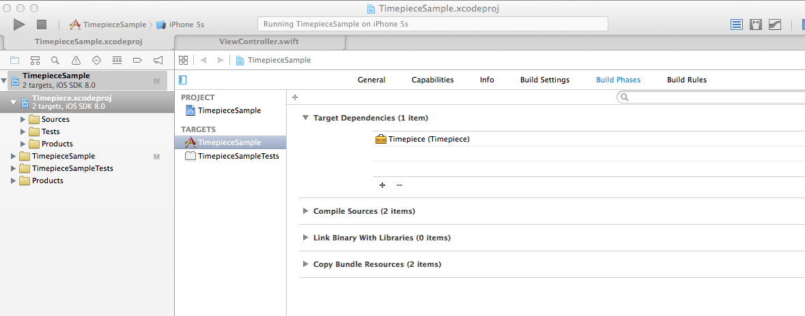

# Timepiece

Swift extensions to calculate time

## Demo

```swift
// Calculate
let now = NSDate()
let dayAfterTomorrow = now + 2.days
let lastMonth = now - 1.month

// Initialize
let birthday = NSDate.date(year: 1987, month: 6, day: 2)
let firstCommitDate = NSDate.date(year: 2014, month: 8, day: 15, hour: 20, minute: 25, second: 43)
let today = NSDate.today()
let tomorrow = NSDate.tomorrow()
let yesterday = NSDate.yesterday()

// Initialize from Int
let nextWeek = 1.week.later
let yearBeforeLast = 2.years.ago

// Initialize by changing components of another date
let christmas = now.change(month: 12, day: 25)
let newYearDay = now.beginningOfYear
let timeLimit = now.endOfHour
```

## Usage

TODO

## Installation

1. Clone this repository as submodule into your project.
2. On Xcode, drag and drop Timepiece.xcodeproj into your project tree.
3. Add Timepiece module into the target dependencies. If you follow up to this step, your xcode will be like a below screenshot.
4. Import Timepiece module.

```swift
import UIKit
import Timepiece // Add this line
```



## Contribution

1. Fork
2. Create your feature branch (git checkout -b my-new-feature)
3. Commit your changes (git commit -am 'Add some feature')
4. Push to the branch (git push origin my-new-feature)
5. Create new Pull Request

## License

Timepiece is available under the MIT license. See the LICENSE file for more info.

## Author

[naoty](https://github.com/naoty)

